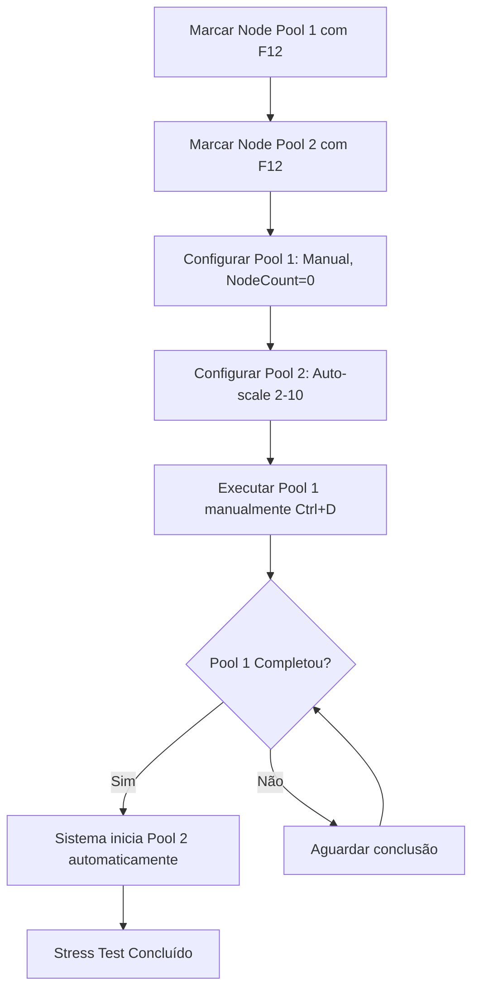

# 🔄 Execução Sequencial de Node Pools para Stress Tests

## 🎯 **Funcionalidade Implementada**

Sistema completo de execução sequencial para **stress tests** de node pools, permitindo que um node pool seja escalado para zero (manual) e após completar, automaticamente iniciar o segundo node pool.

## 🔧 **Como Usar**

### **1. Marcar Node Pools para Execução Sequencial**

No painel "Node Pools Selecionados", use **F12** para marcar node pools:

```
🟢 monitoring-1 *1          ← Primeiro (será executado manualmente)
🟡✨ monitoring-2 *2        ← Segundo (executará automaticamente)
   Auto-scaling: 2-10 nodes (atual: 5)
```

**Controles:**
- **F12**: Marcar/desmarcar node pool
- **Limite**: Máximo 2 node pools marcados
- **Toggle**: Pressionar F12 novamente desmarca

### **2. Configurar Node Pools**

**Node Pool 1 (monitoring-1 *1):**
- Autoscaling: `false` (Manual)
- Node Count: `0` (Para liberar recursos)

**Node Pool 2 (monitoring-2 *2):**
- Autoscaling: `true` (Auto-scaling)
- Min Nodes: `2`
- Max Nodes: `10`

### **3. Executar Sequência**

1. **Primeiro Node Pool**: Execute manualmente com **Ctrl+D** ou **Ctrl+U**
2. **Automático**: Quando o primeiro completar, o segundo inicia automaticamente
3. **Monitoramento**: Acompanhe via logs de debug (`--debug`)

## 📊 **Indicadores Visuais**

### **Marcação Sequencial:**
```
🟢 monitoring-1 *1          ← *1 = Primeiro na sequência
🟡✨ monitoring-2 *2        ← *2 = Segundo na sequência
🟢 monitoring-3             ← Sem marcação = não faz parte da sequência
```

### **Status da Execução:**
- **pending**: Aguardando execução
- **executing**: Sendo executado no momento
- **completed**: Execução concluída
- **failed**: Falhou durante execução

## 🔄 **Fluxo de Execução**



## 💾 **Persistência em Sessões**

Os dados de marcação sequencial são **automaticamente salvos** nas sessões:

### **Estrutura JSON da Sessão:**
```json
{
  "node_pool_changes": [
    {
      "node_pool_name": "monitoring-1",
      "sequence_order": 1,
      "sequence_status": "pending",
      "new_values": {
        "node_count": 0,
        "autoscaling_enabled": false
      }
    },
    {
      "node_pool_name": "monitoring-2",
      "sequence_order": 2,
      "sequence_status": "pending",
      "new_values": {
        "min_node_count": 2,
        "max_node_count": 10,
        "autoscaling_enabled": true
      }
    }
  ]
}
```

### **Restauração:**
- **Marcações preservadas**: `*1`, `*2` restaurados ao carregar sessão
- **Status mantido**: `pending`, `executing`, `completed`
- **Configurações**: Todos os valores dos node pools restaurados

## 🎛️ **Controles Detalhados**

### **No Painel Node Pools Selecionados:**
| Tecla | Ação |
|-------|------|
| `F12` | Marcar/desmarcar para execução sequencial |
| `Ctrl+D` | Aplicar node pool selecionado individualmente |
| `Ctrl+U` | Aplicar todos os node pools selecionados |
| `Ctrl+S` | Salvar sessão (inclui marcações sequenciais) |
| `Enter` | Editar configurações do node pool |

### **Durante Execução:**
- **Logs de Debug**: Use `--debug` para acompanhar o progresso
- **Status Visual**: Indicadores no painel mostram progresso
- **Execução Automática**: Sistema monitora e continua automaticamente

## 🔍 **Logs de Debug**

Com `--debug`, você verá logs como:

```
✅ Node pool monitoring-1 marcado para execução sequencial (ordem 1)
✅ Node pool monitoring-2 marcado para execução sequencial (ordem 2)
⚡ Executando node pool monitoring-1 (ordem 1)
✅ Node pool monitoring-1 (ordem 1) marcado como completed
✅ Primeiro node pool monitoring-1 completado, iniciando segundo node pool monitoring-2
⚡ Executando próximo node pool monitoring-2 (ordem 2)
🎉 Execução sequencial concluída!
```

## ⚡ **Casos de Uso**

### **Stress Test Prometheus Stack:**
1. **monitoring-prometheus-1**: Scale para 0 (liberar recursos)
2. **monitoring-prometheus-2**: Scale para configuração de stress test
3. **Automático**: Transição suave entre configurações

### **Blue-Green Deployment Node Pools:**
1. **app-blue**: Scale para 0 (versão antiga)
2. **app-green**: Scale para produção (nova versão)
3. **Zero Downtime**: Transição automatizada

### **Resource Migration:**
1. **old-nodepool**: Scale para 0 (migrar cargas de trabalho)
2. **new-nodepool**: Scale para capacidade total
3. **Seguro**: Confirmação antes de cada step

## 🛡️ **Proteções e Validações**

- ✅ **Limite de 2 node pools**: Previne configurações complexas
- ✅ **Toggle funcional**: F12 desmarca se já marcado
- ✅ **Status tracking**: Monitora progresso de cada pool
- ✅ **Persistência completa**: Nada se perde ao salvar/carregar
- ✅ **Logs detalhados**: Rastreamento completo de operações

## 🎯 **Status da Implementação**

- 🟢 **Marcação sequencial**: Implementado e funcionando
- 🟢 **Indicadores visuais**: `*1`, `*2` exibidos corretamente
- 🟢 **Execução automática**: Segundo pool inicia após primeiro
- 🟢 **Persistência em sessões**: Dados salvos e restaurados
- 🟢 **Logs de debug**: Rastreamento completo
- 🟢 **Validações**: Limites e proteções implementados

---

**🎯 Funcionalidade pronta para uso em stress tests e deployment scenarios!**