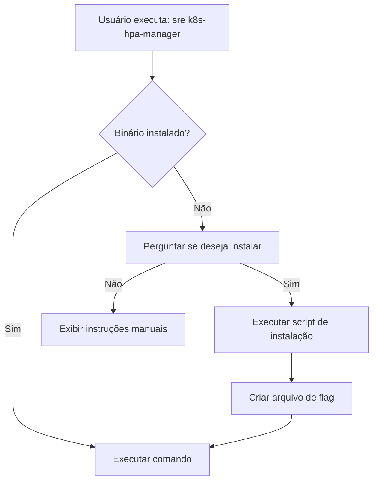

# Integração k8s-hpa-manager com SRE-CLI

## 📋 Objetivo

Integrar o `k8s-hpa-manager` (aplicação Go) como um comando do SRE-CLI (Python), permitindo que usuários executem tanto a interface TUI quanto a Web através do comando `sre k8s-hpa-manager`.

---

## 🏗️ Arquitetura da Integração

### Estrutura de Arquivos no SRE-CLI

```
~/SRE-CLI/
├── cli/
│   └── sre/
│       └── cli/
│           └── sre/
│               └── commands/
│                   └── k8s_hpa_manager.py  # <-- ARQUIVO A CRIAR/SUBSTITUIR
```

### Fluxo de Instalação Automática



### Sistema de Detecção de Instalação

**Arquivo de flag**: `~/.k8s-hpa-manager/.installed`

- **Criado**: Após instalação bem-sucedida
- **Conteúdo**: JSON com metadados
- **Verificação**: Antes de cada execução

---

## 🔧 Implementação Detalhada

### 1. Classe Principal: `HPAManagerWrapper`

```python
class HPAManagerWrapper:
    """Wrapper para o binário k8s-hpa-manager com instalação automática"""

    def __init__(self):
        self.binary = "k8s-hpa-manager"
        self.install_flag = os.path.expanduser("~/.k8s-hpa-manager/.installed")
        self.install_script_url = "https://raw.githubusercontent.com/Paulo-Ribeiro-Log/Scale_HPA/main/install-from-github.sh"
        self.web_url = "http://localhost:8080"
        self.token = "poc-token-123"

    def is_installed(self) -> bool:
        """Verifica se o binário está instalado"""
        # 1. Verifica se arquivo de flag existe
        if not os.path.exists(self.install_flag):
            return False

        # 2. Verifica se binário existe e funciona
        try:
            result = subprocess.run(
                [self.binary, "version"],
                capture_output=True,
                text=True,
                timeout=5
            )
            return result.returncode == 0
        except (subprocess.TimeoutExpired, FileNotFoundError):
            return False

    def install(self) -> bool:
        """Instala o k8s-hpa-manager"""
        click.echo("📦 k8s-hpa-manager não está instalado")
        click.echo("")

        if not click.confirm("Deseja instalar agora?", default=True):
            click.echo("\n📝 Para instalar manualmente, execute:")
            click.echo(f"   curl -fsSL {self.install_script_url} | bash")
            return False

        click.echo("\n🔄 Instalando k8s-hpa-manager...")

        try:
            # Download e execução do script de instalação
            result = subprocess.run(
                f"curl -fsSL {self.install_script_url} | bash",
                shell=True,
                capture_output=True,
                text=True
            )

            if result.returncode == 0:
                # Criar arquivo de flag
                self._create_install_flag()
                click.echo("✅ Instalação concluída com sucesso!")
                return True
            else:
                click.echo(f"❌ Erro na instalação: {result.stderr}", err=True)
                return False

        except Exception as e:
            click.echo(f"❌ Erro ao instalar: {e}", err=True)
            return False

    def _create_install_flag(self):
        """Cria arquivo de flag indicando instalação"""
        import json
        from datetime import datetime

        flag_dir = os.path.dirname(self.install_flag)
        os.makedirs(flag_dir, exist_ok=True)

        # Obter versão instalada
        try:
            result = subprocess.run(
                [self.binary, "version"],
                capture_output=True,
                text=True,
                timeout=5
            )
            version = result.stdout.strip() if result.returncode == 0 else "unknown"
        except:
            version = "unknown"

        metadata = {
            "installed_at": datetime.now().isoformat(),
            "version": version,
            "binary_path": subprocess.run(
                ["which", self.binary],
                capture_output=True,
                text=True
            ).stdout.strip(),
            "installed_by": "sre-cli"
        }

        with open(self.install_flag, 'w') as f:
            json.dump(metadata, f, indent=2)

    def ensure_installed(self) -> bool:
        """Garante que o binário está instalado"""
        if self.is_installed():
            return True

        return self.install()
```

---

### 2. Comandos Click

```python
import click
import subprocess
import sys
import os
import json
import requests
from typing import Optional


@click.group(name="k8s-hpa-manager")
def k8s_hpa_manager():
    """
    K8s HPA Manager - Gerenciador de HPAs e Node Pools do Azure AKS

    Ferramenta para gerenciar Horizontal Pod Autoscalers (HPAs)
    e Node Pools do Azure AKS através de interface TUI ou Web.
    """
    pass


@k8s_hpa_manager.command(name="tui")
@click.option("--debug", is_flag=True, help="Ativa modo debug")
def tui(debug):
    """
    Inicia a interface TUI (Terminal User Interface)

    Interface interativa no terminal com suporte a:
    \b
    - Gerenciamento de HPAs (min/max replicas, targets)
    - Gerenciamento de Node Pools (scaling, autoscaling)
    - Sessions (salvar/carregar configurações)
    - Rollouts de recursos
    - CronJob management (F9)
    - Prometheus Stack (F8)
    - System logs (F3)
    """
    wrapper = HPAManagerWrapper()

    if not wrapper.ensure_installed():
        sys.exit(1)

    cmd = [wrapper.binary]
    if debug:
        cmd.append("--debug")

    try:
        subprocess.run(cmd)
    except KeyboardInterrupt:
        click.echo("\n👋 TUI encerrado pelo usuário")
    except Exception as e:
        click.echo(f"❌ Erro ao executar TUI: {e}", err=True)
        sys.exit(1)


@k8s_hpa_manager.command(name="web")
@click.option("--port", "-p", default=8080, help="Porta do servidor web")
@click.option("--foreground", "-f", is_flag=True, help="Executa em foreground")
def web(port, foreground):
    """
    Inicia o servidor web

    Interface web moderna com:
    \b
    - Dashboard com métricas em tempo real
    - Gerenciamento de HPAs e Node Pools
    - Sistema de sessões (save/load/edit)
    - Busca e filtros avançados (Combobox)
    - Staging area para preview de alterações
    - Auto-shutdown após 20min de inatividade
    """
    wrapper = HPAManagerWrapper()

    if not wrapper.ensure_installed():
        sys.exit(1)

    cmd = [wrapper.binary, "web", "--port", str(port)]
    if foreground:
        cmd.append("-f")

    try:
        if foreground:
            click.echo(f"🌐 Iniciando servidor web em http://localhost:{port}")
            click.echo("   Pressione Ctrl+C para parar")
            subprocess.run(cmd)
        else:
            subprocess.Popen(
                cmd,
                stdout=subprocess.DEVNULL,
                stderr=subprocess.DEVNULL
            )
            click.echo(f"✅ Servidor web iniciado em background")
            click.echo(f"   URL: http://localhost:{port}")
            click.echo(f"   Token: {wrapper.token}")
            click.echo(f"   Logs: tail -f /tmp/k8s-hpa-web.log")
    except KeyboardInterrupt:
        click.echo("\n👋 Servidor encerrado pelo usuário")
    except Exception as e:
        click.echo(f"❌ Erro ao iniciar servidor: {e}", err=True)
        sys.exit(1)


@k8s_hpa_manager.command(name="stop")
def stop():
    """Para o servidor web se estiver rodando"""
    wrapper = HPAManagerWrapper()

    try:
        subprocess.run(["pkill", "-f", "k8s-hpa-manager web"], check=False)
        click.echo("✅ Servidor web parado")
    except Exception as e:
        click.echo(f"❌ Erro ao parar servidor: {e}", err=True)


@k8s_hpa_manager.command(name="status")
def status():
    """Verifica status do servidor web"""
    wrapper = HPAManagerWrapper()

    try:
        response = requests.get(f"{wrapper.web_url}/health", timeout=2)
        if response.status_code == 200:
            click.echo(f"✅ Servidor rodando em {wrapper.web_url}")

            # Mostra versão
            result = subprocess.run(
                [wrapper.binary, "version"],
                capture_output=True,
                text=True,
                timeout=2
            )
            if result.returncode == 0:
                click.echo(f"   {result.stdout.strip()}")
        else:
            click.echo(f"⚠️  Status: {response.status_code}")
    except requests.exceptions.ConnectionError:
        click.echo("❌ Servidor web não está rodando")
    except requests.exceptions.Timeout:
        click.echo("⚠️  Servidor não respondeu (timeout)")
    except Exception as e:
        click.echo(f"❌ Erro: {e}", err=True)


@k8s_hpa_manager.command(name="autodiscover")
def autodiscover():
    """
    Executa auto-descoberta de clusters

    Escaneia o kubeconfig e descobre automaticamente clusters AKS,
    extraindo resource groups e subscriptions via Azure CLI.
    """
    wrapper = HPAManagerWrapper()

    if not wrapper.ensure_installed():
        sys.exit(1)

    click.echo("🔍 Executando auto-descoberta de clusters...")

    try:
        result = subprocess.run(
            [wrapper.binary, "autodiscover"],
            capture_output=True,
            text=True
        )

        if result.returncode == 0:
            click.echo(result.stdout)
        else:
            click.echo(f"❌ Erro: {result.stderr}", err=True)
            sys.exit(1)
    except Exception as e:
        click.echo(f"❌ Erro: {e}", err=True)
        sys.exit(1)


@k8s_hpa_manager.command(name="version")
def version():
    """Mostra versão do k8s-hpa-manager"""
    wrapper = HPAManagerWrapper()

    if not wrapper.is_installed():
        click.echo("❌ k8s-hpa-manager não está instalado")
        click.echo("   Execute: sre k8s-hpa-manager tui (para instalar)")
        sys.exit(1)

    try:
        result = subprocess.run(
            [wrapper.binary, "version"],
            capture_output=True,
            text=True
        )

        if result.returncode == 0:
            click.echo(result.stdout)
        else:
            click.echo(f"❌ Erro: {result.stderr}", err=True)
            sys.exit(1)
    except Exception as e:
        click.echo(f"❌ Erro: {e}", err=True)
        sys.exit(1)


@k8s_hpa_manager.command(name="update")
def update():
    """
    Verifica e instala atualizações disponíveis

    Usa o script de auto-update para verificar e instalar
    a versão mais recente do k8s-hpa-manager.
    """
    wrapper = HPAManagerWrapper()

    if not wrapper.is_installed():
        click.echo("❌ k8s-hpa-manager não está instalado")
        sys.exit(1)

    update_script = os.path.expanduser("~/.k8s-hpa-manager/scripts/auto-update.sh")

    if not os.path.exists(update_script):
        click.echo("❌ Script de update não encontrado", err=True)
        sys.exit(1)

    try:
        click.echo("🔄 Verificando atualizações...")
        subprocess.run([update_script, "--yes"])

        # Atualiza metadata do arquivo de flag
        wrapper._create_install_flag()
    except Exception as e:
        click.echo(f"❌ Erro ao executar update: {e}", err=True)
        sys.exit(1)


@k8s_hpa_manager.command(name="uninstall")
def uninstall():
    """
    Desinstala o k8s-hpa-manager

    Remove o binário e limpa arquivos de configuração.
    """
    wrapper = HPAManagerWrapper()

    if not wrapper.is_installed():
        click.echo("ℹ️  k8s-hpa-manager não está instalado")
        sys.exit(0)

    if not click.confirm("⚠️  Deseja realmente desinstalar o k8s-hpa-manager?", default=False):
        click.echo("❌ Desinstalação cancelada")
        sys.exit(0)

    uninstall_script = os.path.expanduser("~/.k8s-hpa-manager/scripts/uninstall.sh")

    if os.path.exists(uninstall_script):
        try:
            subprocess.run([uninstall_script])

            # Remove arquivo de flag
            if os.path.exists(wrapper.install_flag):
                os.remove(wrapper.install_flag)

            click.echo("✅ Desinstalação concluída")
        except Exception as e:
            click.echo(f"❌ Erro ao desinstalar: {e}", err=True)
            sys.exit(1)
    else:
        click.echo("❌ Script de desinstalação não encontrado")
        sys.exit(1)


if __name__ == "__main__":
    k8s_hpa_manager()
```

---

## 📝 Estrutura do Arquivo de Flag

**Arquivo**: `~/.k8s-hpa-manager/.installed`

```json
{
  "installed_at": "2025-10-31T20:30:15.123456",
  "version": "k8s-hpa-manager versão 1.3.2",
  "binary_path": "/usr/local/bin/k8s-hpa-manager",
  "installed_by": "sre-cli"
}
```

---

## 🚀 Comandos Disponíveis no SRE-CLI

### Comando Principal

```bash
sre k8s-hpa-manager --help
```

### Subcomandos

| Comando | Descrição | Exemplo |
|---------|-----------|---------|
| `tui` | Inicia interface TUI | `sre k8s-hpa-manager tui` |
| `tui --debug` | TUI em modo debug | `sre k8s-hpa-manager tui --debug` |
| `web` | Inicia servidor web (background) | `sre k8s-hpa-manager web` |
| `web -p 9000` | Servidor em porta customizada | `sre k8s-hpa-manager web -p 9000` |
| `web -f` | Servidor em foreground (logs) | `sre k8s-hpa-manager web -f` |
| `stop` | Para o servidor web | `sre k8s-hpa-manager stop` |
| `status` | Verifica status do servidor | `sre k8s-hpa-manager status` |
| `autodiscover` | Auto-descobre clusters | `sre k8s-hpa-manager autodiscover` |
| `version` | Mostra versão | `sre k8s-hpa-manager version` |
| `update` | Atualiza para versão mais recente | `sre k8s-hpa-manager update` |
| `uninstall` | Desinstala a ferramenta | `sre k8s-hpa-manager uninstall` |

---

## 📦 Dependências Python

Adicionar ao `requirements.txt` do SRE-CLI:

```txt
requests>=2.31.0
click>=8.1.0
```

---

## 🧪 Fluxo de Testes

### Teste 1: Primeira Execução (Instalação)

```bash
# Usuário nunca instalou
sre k8s-hpa-manager tui

# Saída esperada:
# 📦 k8s-hpa-manager não está instalado
#
# Deseja instalar agora? [Y/n]: y
#
# 🔄 Instalando k8s-hpa-manager...
# ✅ Instalação concluída com sucesso!
# [TUI inicia automaticamente]
```

### Teste 2: Execuções Subsequentes

```bash
# Usuário já instalou
sre k8s-hpa-manager tui

# Saída esperada:
# [TUI inicia diretamente sem perguntar instalação]
```

### Teste 3: Verificar Status

```bash
sre k8s-hpa-manager version

# Saída esperada:
# k8s-hpa-manager versão 1.3.2
# 🔍 Verificando updates...
# ✅ Você está usando a versão mais recente
```

### Teste 4: Servidor Web

```bash
# Iniciar servidor
sre k8s-hpa-manager web

# Saída esperada:
# ✅ Servidor web iniciado em background
#    URL: http://localhost:8080
#    Token: poc-token-123
#    Logs: tail -f /tmp/k8s-hpa-web.log

# Verificar status
sre k8s-hpa-manager status

# Saída esperada:
# ✅ Servidor rodando em http://localhost:8080
#    k8s-hpa-manager versão 1.3.2

# Parar servidor
sre k8s-hpa-manager stop

# Saída esperada:
# ✅ Servidor web parado
```

---

## 🔄 Integração com setup.py do SRE-CLI

Adicionar entry point no `setup.py`:

```python
entry_points={
    'console_scripts': [
        'sre=sre.cli.sre.main:cli',  # Comando principal existente
    ],
},
```

Garantir que `k8s_hpa_manager.py` seja importado no `__init__.py` dos comandos:

```python
# Em: ~/SRE-CLI/cli/sre/cli/sre/commands/__init__.py
from .k8s_hpa_manager import k8s_hpa_manager
```

---

## 📊 Diagrama de Estados

```
┌─────────────────────────────────────────────────────────────┐
│                    Primeira Execução                        │
└─────────────────────────────────────────────────────────────┘
                              │
                              ▼
                    ┌─────────────────┐
                    │ Verificar flag  │
                    │   ~/.k8s-hpa-   │
                    │ manager/.inst.  │
                    └─────────────────┘
                              │
                    ┌─────────┴─────────┐
                    │                   │
               Flag NÃO existe     Flag existe
                    │                   │
                    ▼                   ▼
         ┌──────────────────┐  ┌──────────────────┐
         │ Perguntar ao     │  │ Verificar binário│
         │ usuário se       │  │    funciona      │
         │ deseja instalar  │  └──────────────────┘
         └──────────────────┘           │
                    │              ┌────┴────┐
            ┌───────┴───────┐      │         │
            │               │   Funciona  Não funciona
          SIM              NÃO     │         │
            │               │      │         ▼
            ▼               ▼      │    ┌─────────┐
    ┌─────────────┐  ┌──────────┐ │    │ Reinstal│
    │ curl install│  │ Mostrar  │ │    │  ar     │
    │   script    │  │ instruçõe│ │    └─────────┘
    │             │  │  s manuai│ │         │
    └─────────────┘  │  s       │ │         │
            │        └──────────┘ │         │
            ▼                     │         │
    ┌─────────────┐              │         │
    │ Criar flag  │              │         │
    │ .installed  │              │         │
    └─────────────┘              │         │
            │                    │         │
            └────────────────────┴─────────┘
                        │
                        ▼
                ┌──────────────┐
                │ Executar     │
                │  comando     │
                └──────────────┘
```

---

## ✅ Checklist de Implementação

### Fase 1: Setup Básico
- [ ] Criar arquivo `k8s_hpa_manager.py` no diretório de comandos
- [ ] Implementar classe `HPAManagerWrapper`
- [ ] Adicionar lógica de detecção de instalação (arquivo de flag)
- [ ] Adicionar dependências no `requirements.txt`

### Fase 2: Instalação Automática
- [ ] Implementar método `is_installed()`
- [ ] Implementar método `install()`
- [ ] Implementar método `_create_install_flag()`
- [ ] Implementar método `ensure_installed()`

### Fase 3: Comandos Click
- [ ] Implementar comando `tui` (com --debug)
- [ ] Implementar comando `web` (com --port e --foreground)
- [ ] Implementar comando `stop`
- [ ] Implementar comando `status`
- [ ] Implementar comando `autodiscover`
- [ ] Implementar comando `version`
- [ ] Implementar comando `update`
- [ ] Implementar comando `uninstall`

### Fase 4: Integração SRE-CLI
- [ ] Importar comando no `__init__.py` dos comandos
- [ ] Registrar no grupo principal do SRE-CLI
- [ ] Testar comando `sre k8s-hpa-manager --help`

### Fase 5: Testes
- [ ] Testar primeira instalação
- [ ] Testar execução após instalação
- [ ] Testar todos os subcomandos
- [ ] Testar atualização
- [ ] Testar desinstalação

---

## 📚 Referências

- **Repositório k8s-hpa-manager**: https://github.com/Paulo-Ribeiro-Log/Scale_HPA
- **Release atual**: v1.3.2
- **Documentação completa**: [CLAUDE.md](https://github.com/Paulo-Ribeiro-Log/Scale_HPA/blob/main/CLAUDE.md)
- **Script de instalação**: [install-from-github.sh](https://raw.githubusercontent.com/Paulo-Ribeiro-Log/Scale_HPA/main/install-from-github.sh)

---

## 🔗 Links Úteis

- Script de auto-update: `~/.k8s-hpa-manager/scripts/auto-update.sh`
- Script de uninstall: `~/.k8s-hpa-manager/scripts/uninstall.sh`
- Logs do servidor web: `/tmp/k8s-hpa-web.log`
- Arquivo de flag: `~/.k8s-hpa-manager/.installed`

---

**Documento criado em**: 31 de outubro de 2025
**Versão do k8s-hpa-manager**: v1.3.2
**Para**: Projeto SRE-CLI Python
